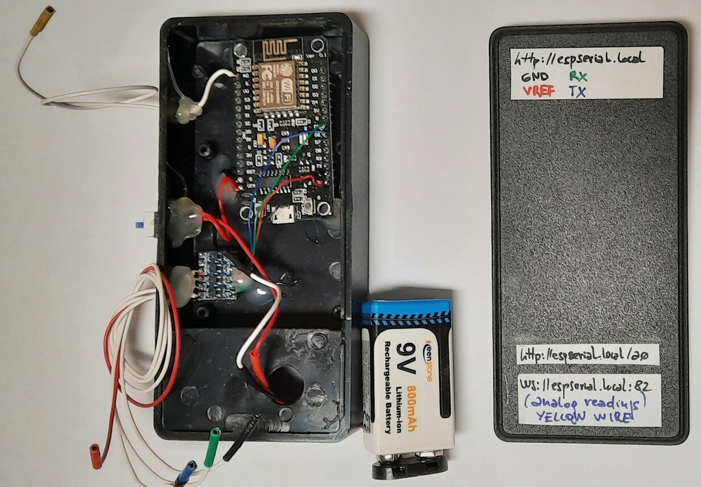
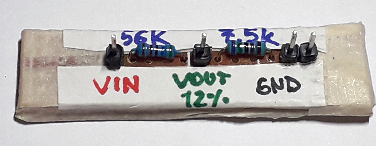

# iot-esp8266-serial-fwd

Allow to monitor(read) and interact(write) a TTL serial 3.3V over wifi or data log analog readings.

<hr/>

<!-- TOC -->
* [features](#features)
* [wirings](#wirings)
* [flash the firmware](#flash-the-firmware)
* [configure wifis](#configure-wifis)
* [application example](#application-example)
  + [as a serial forwader](#as-a-serial-forwader)
  + [as a voltage logger](#as-a-voltage-logger)
* [how this project was built](#how-this-project-was-built)
* [references](#references)
<!-- TOCEND -->

<hr/>


## features

- default speed can be changed and saved
- send text ( one line ) can be autouppercased
- multiple wifi routers can be inserted in the [code](https://github.com/devel0/iot-esp8266-serial-fwd/blob/42cefa981820aebe436a02f99a68831d79f1686e/src/main.cpp#L148) and strongest will connected
- if no router available you can connect directly to esp in Access Point mode to its own network ( url http://192.168.4.1 )
- from desktop web browser mDNS allow to locate at http://espserial.local

## wirings

software serial on D5 (RX) and D6 (TX) used to avoid conflicting with GPIO3/GPIO1 used in flashing firmware.


:warning: be careful to connect 5v serial to esp pins ; to be sure use a simple logic converter level like `level converter mh` based on `BSS138` chip:
- LV to 3.3V of esp
- LV1, LV2 to esp RX, TX
- HV to external serial level (eg. 5V)
- HV1, HV2 to external serial TX, RX

## flash the firmware

- open folder in vscode
- if platformio warn about arduino extension you can disable ( for workspace ) from extensions
- ctrl+shift+u to upload firmware
- `data` files can be uploaded to esp spiffs using platformio tasks/nodemcuv2/Platform/Upload Filesystem image


## configure wifis

create your own `.h` file and set into [main.cpp](https://github.com/devel0/iot-esp8266-serial-fwd/blob/42cefa981820aebe436a02f99a68831d79f1686e/src/main.cpp#L19) right path then set them at [startWiFi()](https://github.com/devel0/iot-esp8266-serial-fwd/blob/42cefa981820aebe436a02f99a68831d79f1686e/src/main.cpp#L148) function.

```c
#ifndef _MY_WIFI_KEY_H_
#define _MY_WIFI_KEY_H_
#define WIFI_SSID "myssid"
#define WIFI_KEY "mysecretkey"
#endif
```

## application example

### as a serial forwader


This box allow you to interact with serial of devices either 3v3 or 5v due to the level converter inside the box.

In the photo above an adrduino serial can be used in parallel either with usb or through wifi connecting to http://espserial.local after device power on.

Esp8266 powered through G, VIN pins by a 9V rechargable LiOn battery.
External red wire ( VREF ) is to be connected to 5V of arduino so that level converter bss138 can recognize the signal and convert to the 3v3 of esp8266.

Notes about wiring lvl converter:
- GND, LV, L1, L2 connects to esp8266 GND, 3V3, D5, D6
- GND, HV, H1, H2 are black, red (VREF), green (RX), blue (TX) external wires.
- green wire ( rx of esp8266 ) is connected to arduino TX.
- blue wire ( tx of esp8266 ) is connected to arduino RX.

### as a voltage logger



adc retrieves 0-1023 when voltages vary from 0V to VCC ( check red wire voltage, mine is actually 3.161V ) . Natively can monitor 0-3V but can easily extended using a [voltage divider](https://en.wikipedia.org/wiki/Voltage_divider) to monitor up to 25V for example using `[Vin]---[R1=56k]---[yellow]---[R2=7.5k]---[GND]` where Vout (yellow) = 7.5k / (56k+7.5k) * Vin = 0.12 * Vin



- connect black to the same gnd to monitor
- connect yellow to the point of voltage to monitor

adc value can be read one shot using GET

```sh
devel0@tuf:~$ echo "val=$(curl -s espserial.local/a0)"
val=969
```

or in continuous mode from websocket ( port 82 ) and using ctrl+c to stop. ( [websocat](https://github.com/vi/websocat) required to do this from cmdline )

```sh
devel0@tuf:~$ websocat ws://espserial.local:82 | while IFS= read -r line; do echo "adc=[$line] V=[$(printf "%0.3f" $(echo "$line / 1023 * 3.161" | bc -l))]"; done
adc=[968] V=[2.991]
adc=[968] V=[2.991]
...
```

or to monitor each seconds

```sh
while true; do
        val="$(curl -s http://espserial.local/a0)"
        echo "$(date +%Y-%m-%d\ %H:%M.%S) adc=[$val] V=[$(printf "%0.3f" $(echo "$val / 1023 * 3.161" | bc -l))]";
        sleep 1
done
```

results in follow

```
2021-07-30 02:42.11 adc=[950] V=[2.935]
...
```

*scripts*

put [these scripts](scripts) in path to use `voltage-logger-<util>`

## how this project was built

- install arduino
- install vscode
- install platformio
- from platformio / project / new ( board : nodemcu v1.0 )

## references

- [A Beginner's Guide to the ESP8266](https://tttapa.github.io/ESP8266/Chap01%20-%20ESP8266.html)