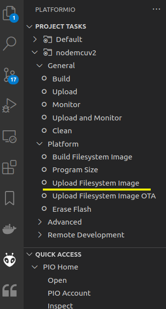

# iot-esp8266-serial-fwd

Allow to monitor(read) and interact(write) a TTL serial 3.3V over wifi.


## features

- default speed can be changed and saved
- send text ( one line ) can be autouppercased
- multiple wifi routers can be inserted in the [code]() and strongest will connected
- if no router available you can connect directly to esp in Access Point mode to its own network ( url http://192.168.4.1 )
- from desktop web browser mDNS allow to locate at http://espserial.local

## wirings

software serial on D5 (RX) and D6 (TX) used to avoid conflicting with GPIO3/GPIO1 used in flashing firmware.


:warning: be careful to connect 5v serial to esp pins ; to be sure use a simple logic converter level like `level converter mh` based on `BSS138` chip:
- LV to 3.3V of esp
- LV1, LV2 to esp RX, TX
- HV to external serial level (eg. 5V)
- HV1, HV2 to external serial TX, RX

## flash the firmware

- open folder in vscode
- if platformio warn about arduino extension you can disable ( for workspace ) from extensions
- ctrl+shift+u to upload firmware
- `data` files can be uploaded to esp spiffs using platformio tasks/nodemcuv2/Platform/Upload Filesystem image



## configure wifis

create your own `.h` file and set into main.cpp right path then set them at startWiFi() function.

```c
#ifndef _MY_WIFI_KEY_H_
#define _MY_WIFI_KEY_H_
#define WIFI_SSID "myssid"
#define WIFI_KEY "mysecretkey"
#endif
```

## how this project was built

- install arduino
- install vscode
- install platformio
- from platformio / project / new ( board : nodemcu v1.0 )

## references

- [A Beginner's Guide to the ESP8266](https://tttapa.github.io/ESP8266/Chap01%20-%20ESP8266.html)